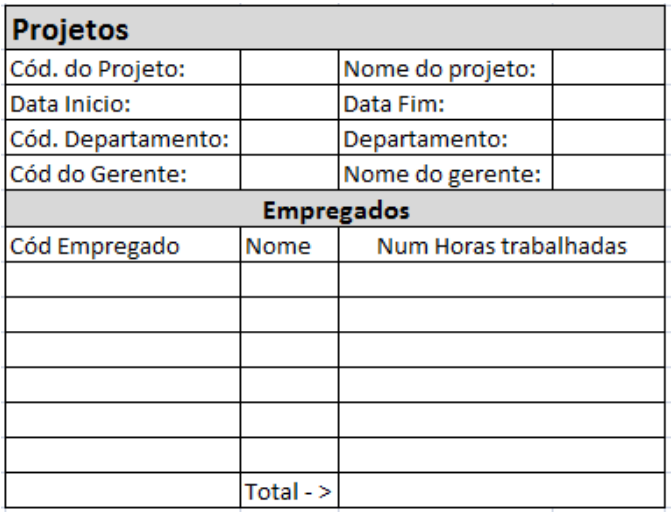

# Banco de Dados 1

Este repositório contém nossa submissão do projeto da Segunda Avaliação de
Aprendizagem para a disciplina de Banco de Dados 1 da UNIESP.

O projeto consiste em realizar a modelagem de dados a partir de uma tabela
simples, incluindo:

- Normalização dos Dados
- Diagramas de Entidade Relacionamento ([modelos conceitual](docs/er-model.drawio) e [lógico](docs/er-diagram.dbml))
- [Script de inicialização](src/init.sql)
- Dicionário de Dados

## Tema

O tema escolhido para o projeto foi o

## Autores

- [Carlos Neto](https://github.com/CarlosNeto-dev)
- [Jacques Ramondot](https://github.com/Jacquesnethow)
- [Pedro Brunet](https://github.com/Pedrobrunet)
- [Vinícius Oliveira](https://github.com/vinicius507)
