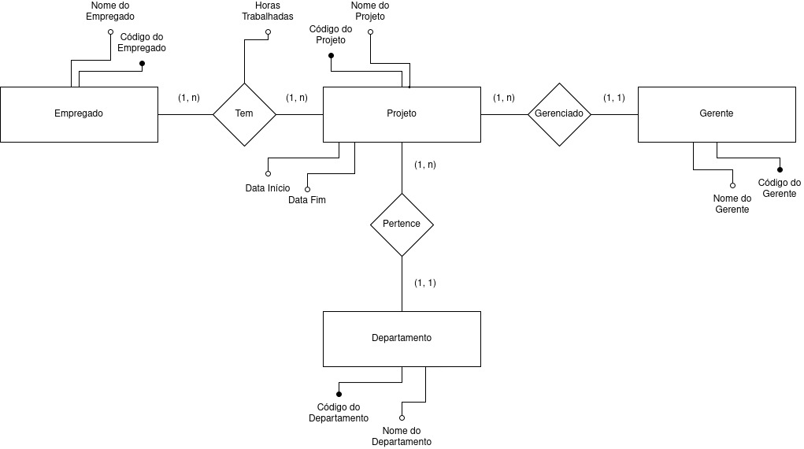
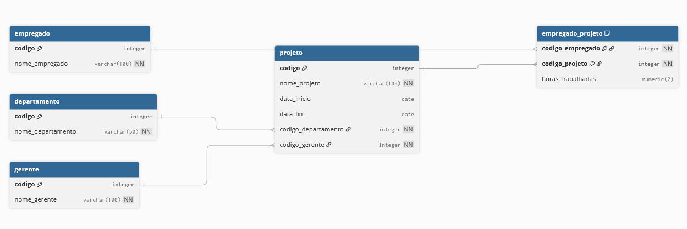

# Banco de Dados 1

Este repositório contém nossa submissão do projeto da Segunda Avaliação de
Aprendizagem para a disciplina de Banco de Dados 1 da UNIESP.

O projeto consiste em realizar a modelagem de dados a partir de uma tabela
simples, incluindo:

- Normalização dos Dados
- Diagramas de Entidade Relacionamento ([modelos conceitual](docs/er-model.drawio) e [lógico](docs/er-diagram.dbml))
- [Script de inicialização](src/init.sql)
- Dicionário de Dados

## Situação Problema

## Normalização

A tabela proposta pode ser descrita da seguinte maneira usando a notação textual do modelo relacional:

Projeto(**codigo**, nome, data_inicio, data_fim, Departamento(**codigo**, nome), Gerente(**codigo**, nome), Empregado(**codigo**, nome, horas_trabalhadas))

Percebe-se a presença clara de tabelas aninhadas, violando a _1NF_ (1a forma normal), logo, é _NNF_ (não normalizado).
Para que possamos estar de acordo com a _1NF_, precisamos extrair as tabelas aninhadas:

Departamento(**codigo**, nome)

Gerente(**codigo**, nome)

Empregado(**codigo**, nome, horas_trabalhadas)

Projeto(**codigo**, nome, data*inicio, data_fim, \_codigo_departamento*, _codigo_gerente_)

Participa(_**codigo_empregado**_, _**codigo_projeto**_)

## Diagramas

## Autores

- [Carlos Neto](https://github.com/CarlosNeto-dev)
- [Jacques Ramondot](https://github.com/Jacquesnethow)
- [Pedro Brunet](https://github.com/Pedrobrunet)
- [Vinícius Oliveira](https://github.com/vinicius507)
